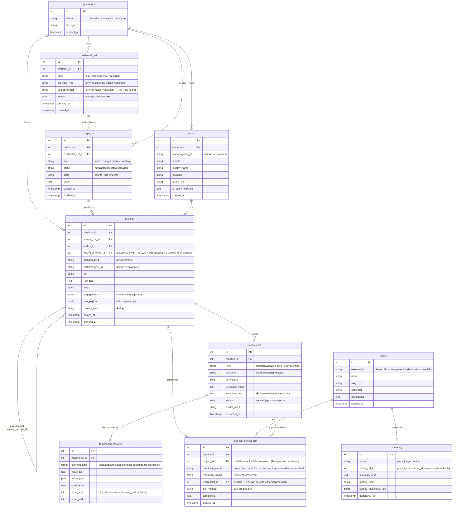

# Testimonial Scraper — Data Model / ER Diagram

> Status: **draft v2** — Langdon review pass 1 folded in (see "Review pass 1" at the bottom). Scope: capture social mentions/testimonials
> about Spark (LinkedIn-first), tie them back to Spark projects, store atomic
> testimonial elements, and enable generated summaries later.

## Design principles

1. **Raw vs. derived separation.** `mention` stores the raw scraped post verbatim
   (immutable, re-processable). `testimonial` + `testimonial_element` are *derived*
   artifacts produced by extraction; they can be regenerated without re-scraping.
2. **No raw secrets in the DB.** `credential_set` stores only a *locator* (provider
   type + key name), never the password/token. Actual secrets live in env / a secret
   manager, resolved at runtime by a `CredentialProvider`. This is what makes creds
   pluggable (your creds now → BU Spark creds later) and keeps the DB safe to share.
3. **Confidence everywhere it's inferred.** Any link or extraction the system *guesses*
   (mention→project, extracted quote) carries a `confidence` + `link_method`
   (auto / llm / manual) so humans can review and override.
4. **Idempotent scraping.** `platform_post_id` + `content_hash` let re-runs dedupe
   instead of duplicating. Every row traces to the `scrape_run` that produced it.
5. **Comments are mentions.** A comment on a post is captured as a `mention` with a
   `parent_mention_id` self-reference (`mention_kind = comment`), so it flows through
   the same author → testimonial → project pipeline as a top-level post. No separate
   entity.
6. **Collection never blocks on project mapping.** Scraping only writes raw `mention`
   rows. Tying a mention to a `project` is a *second pass*: an unresolved reference is
   stored (candidate name + confidence), never dropped, and reconciled later.

## ER diagram

## Entity notes

- **platform** — seed table; one row per supported network. LinkedIn first.
- **credential_set** — the pluggability seam. `provider_type` selects a
  `CredentialProvider` implementation; `secret_locator` tells it *where* to fetch.
  Swapping personal → BU Spark creds = insert a new row, no code change.
  `provider_type = pgcrypto` is an optional variant (Langdon's suggestion): the secret
  lives in an encrypted DB column and the decryption key (KEK) is the single env
  secret — one secret instead of many, still no plaintext in the DB. Default stays
  `env` (DB holds nothing sensitive at all); see ARCHITECTURE.md.
- **scrape_run** — audit + idempotency anchor. Lets us answer "what did the
  2026-06-23 LinkedIn run find?" and resume/partial-fail cleanly.
- **author / mention** — raw capture, deduped by `(platform_id, platform_post_id)`
  and `content_hash`. `raw_payload` keeps the full object so re-extraction never
  needs a re-scrape. A **comment** is a `mention` with `mention_kind = comment` and
  `parent_mention_id` set to the post it replies to — same pipeline, no new entity.
- **project** — a *mirror* of ProjectShowcase projects (synced via `external_id`),
  so the scraper can run independently without a live cross-DB join.
- **mention_project_link** — the "tie mentions back to projects" requirement.
  M:N, with method+confidence for human review. **Second pass:** `project_id` is
  nullable — a reference extraction can't yet match to a `project` is stored with its
  `candidate_name` and `resolution_status = unresolved`, so collection is never
  blocked and mapping is reconciled later (Langdon's review).
- **testimonial / testimonial_element** — derived, regenerable. Elements are the
  "individual testimonial elements" Langdon asked to store.
- **summary** — the "generated summary later" requirement; references the
  testimonials it was built from for traceability.

## Open questions for Langdon

1. Should `project` be a synced mirror of the ProjectShowcase Postgres, or a live
   FK into that DB? (Mirror = decoupled + scraper runs offline; live = always fresh.)
2. Is approval (`testimonial.status`) a human step, or auto-approve above a
   confidence threshold?
3. Retention: do we keep `raw_payload` indefinitely (ToS / privacy), or purge after
   extraction?

## Review pass 1 (Langdon) — resolutions

1. **Capture comments on posts, not just posts.** Yes — a comment is a `mention` with
   `parent_mention_id` (self-FK) + `mention_kind = comment`. One nullable column, no
   new entity; comments flow through the same author → testimonial → project pipeline.
2. **Don't block collection trying to map to a project — make it a second pass.**
   `mention_project_link.project_id` is now nullable; an unresolved reference is kept
   (`candidate_name` + `resolution_status = unresolved`) for later reconciliation
   instead of being dropped. Collection writes raw mentions with zero project
   dependency. *(Also fixes current code that silently skips unknown project names —
   `persistence.py` around the `project_links` loop.)*
3. **Store creds in the DB via Postgres encrypted fields, one decryption key.**
   Supported with **no schema change** as a `provider_type = pgcrypto`
   `CredentialProvider`: the `secret_locator` points at an encrypted column and the
   KEK is the one env secret. Kept **optional** — default stays locator/`env` (DB holds
   nothing sensitive; a breach yields nothing; no KEK to guard). Adopt pgcrypto only if
   centralizing many BU Spark creds justifies it; don't hand-roll crypto.

> Note: `er_diagram_chen.{dot,png,svg}` in this folder are the **v1** exports —
> regenerate them from this v2 model before the next review.
