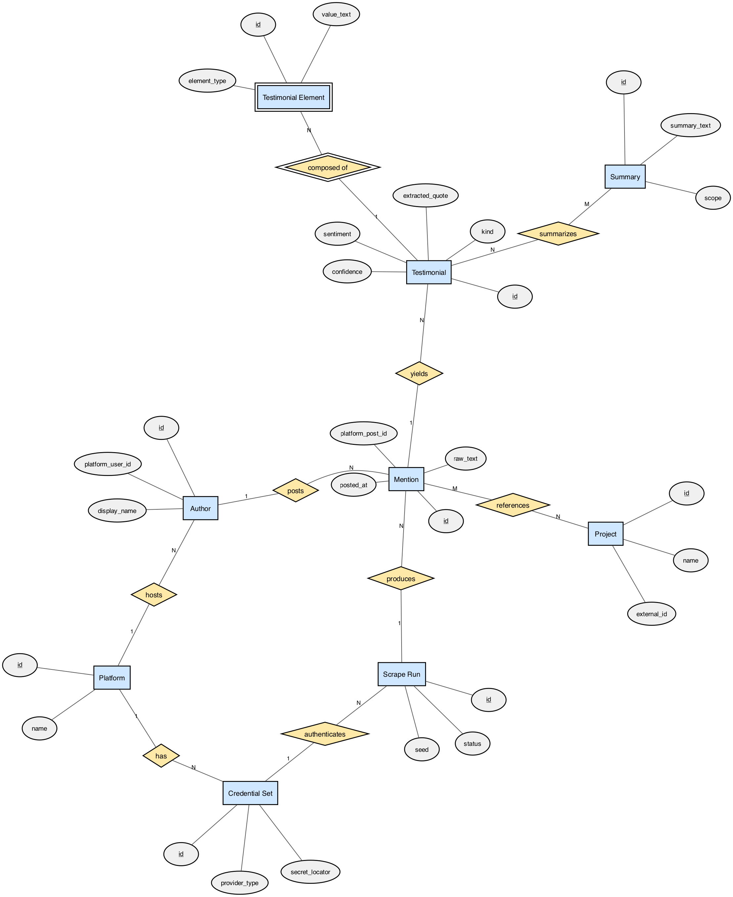

# Spark Testimonial Scraper — Data Model (review doc)

One-page reference for review. Goal: walk social platforms (LinkedIn first), find
posts/mentions/testimonials about **Spark**, tie them back to Spark projects, store
the atomic testimonial elements, and enable generated summaries later.

---

## Diagrams

### 1. ER diagram (Chen notation — conceptual)
> Rectangles = entities, **double rectangle** = weak entity, ovals = attributes (PK underlined),
> diamonds = relationships, **double diamond** = identifying relationship, `1 / N / M` = cardinality.



*Source files: `er_diagram_chen.dot` (editable), `er_diagram_chen.png`, `er_diagram_chen.svg` (crisp for slides).*
*When transferring to a doc, paste the PNG/SVG here.*

### 2. Database schema diagram (physical — tables / keys)
> The implementation view: tables, typed columns, foreign keys (crow's-foot).

```
┌─────────────────────────────────────────────────────────┐
│  [ PLACE DB SCHEMA IMAGE HERE ]                           │
│                                                           │
│  The schema-style diagram is written as Mermaid in        │
│  DATA_MODEL.md (the ```mermaid erDiagram block).          │
│  Render it at https://mermaid.live (paste the block) or   │
│  ask me to export it to PNG/SVG and drop it in.           │
└─────────────────────────────────────────────────────────┘
```

---

## How to read cardinality (`1` / `N` / `M`)

- **`1`** = exactly one. **`N` / `M`** = many (two letters just mark the two "many" sides of a many-to-many; they don't mean equal counts).
- **`1 — N` (one-to-many):** "one mom, many kids." e.g. one Author → many Mentions; each Mention → one Author.
- **`M — N` (many-to-many):** "many students, many classes." e.g. a Mention names many Projects, a Project is named in many Mentions.
- Every `M — N` relationship becomes a **join table** when built (which is why the schema has `mention_project_link`).

---

## Entities (the "things" — rectangles)

1. **Platform** — a social network we scrape. LinkedIn first; X/Instagram later. *(attrs: `id`, `name`)*
2. **Credential Set** — the login used to access a platform. Stores only a **locator** (where the secret lives — an env var name / vault path), **never** the actual password/cookie. This is the swap-your-creds-now → BU-Spark-creds-later seam. *(`id`, `provider_type`, `secret_locator`)*
3. **Scrape Run** — one execution of a scrape job. The audit + idempotency anchor: "what did the June 25 LinkedIn run find?" *(`id`, `seed`, `status`)*
4. **Author** — the person/account that posted something. *(`id`, `platform_user_id`, `display_name`)*
5. **Mention** — a **raw** scraped post, stored verbatim and never modified. The source of truth everything else is derived from. *(`id`, `platform_post_id`, `raw_text`, `posted_at`)*
6. **Project** — a Spark project (a mirror of the ProjectShowcase project, linked by `external_id`), so testimonials can tie back to real projects. *(`id`, `name`, `external_id`)*
7. **Testimonial** — a **derived** testimonial *extracted* from a mention by Claude. Regenerable without re-scraping. *(`id`, `kind`, `sentiment`, `confidence`, `extracted_quote`)*
8. **Testimonial Element** *(weak entity — double rectangle)* — an atomic piece of a testimonial (a quote, an outcome, a metric, a project reference…). **Weak** because it can't exist without its parent testimonial. *(`id`, `element_type`, `value_text`)*
9. **Summary** — a generated, aggregate write-up over many testimonials (global, per-project, or per-author). *(`id`, `scope`, `summary_text`)*

---

## Relationships (the diamonds)

1. **has** — A **Platform** *has* many **Credential Sets** (`1—N`). LinkedIn might hold your personal login today and BU Spark's login later; each credential set belongs to exactly one platform. Lets us register a new login as a single row without touching code.

2. **authenticates** — A **Credential Set** *authenticates* many **Scrape Runs** (`1—N`). Every scrape records which credential set it logged in with, so we always know "this batch was pulled using the BU Spark account," and a run traces back to exactly one set of creds.

3. **hosts** — A **Platform** *hosts* many **Authors** (`1—N`). Every author lives on one platform (a LinkedIn author is distinct from an X author, even for the same human), and a platform accumulates many authors over time.

4. **produces** — A **Scrape Run** *produces* many **Mentions** (`1—N`). One execution sweeps up a batch of posts; each mention is stamped with the single run that found it — how we answer "what did the June 25 run bring in?"

5. **posts** — An **Author** *posts* many **Mentions** (`1—N`). A person can say many things about Spark over time, but any single post was written by exactly one author — so we can later roll up "everything this person said."

6. **yields** — A **Mention** *yields* many **Testimonials** (`1—N`). One raw post might contain several distinct endorsements (or none); each extracted testimonial points back to the one mention it came from, keeping the link to the original source intact.

7. **composed of** *(identifying, double diamond)* — A **Testimonial** is *composed of* many **Testimonial Elements** (`1—N`). We break each testimonial into atomic pieces — a quote, an outcome, a metric. Because an element is meaningless without its parent, this relationship is what *gives the weak entity its identity*.

8. **references** — A **Mention** *references* many **Projects**, and a **Project** is referenced by many **Mentions** (`M—N`). The heart of the "tie testimonials back to projects" goal: one post might praise two Spark projects, and one project might be mentioned across dozens of posts. Being many-to-many, it becomes its own join table in the real database.

9. **summarizes** — A **Summary** *summarizes* many **Testimonials**, and a **Testimonial** can feed many **Summaries** (`M—N`). A single digest is built from a whole set of testimonials, while any one testimonial might appear in several digests (a global roundup *and* its project's page) — so we record exactly which testimonials each summary was built from.

---

## The story it tells (top to bottom)

A **Platform** + a **Credential Set** drive a **Scrape Run**, which **produces** raw **Mentions**
written by **Authors**. Each Mention **yields** **Testimonials**, which are **composed of** atomic
**Elements** and **reference** the Spark **Projects** they're about. Finally, **Summaries** roll many
Testimonials up into a digest.

**Two design calls worth noting:**
- **Credential Set holds no secret** — only a pointer to where the secret lives. Safe to share; swap personal → BU Spark creds by adding one row, no code change.
- **Raw (Mention) vs. derived (Testimonial/Element)** — re-running extraction never needs a re-scrape, so prompts can improve and testimonials regenerate over the same raw data.

---

## Review pass 1 (Langdon) — resolutions

1. **Capture comments on posts, not just the posts.** A comment is a **Mention** with a `parent_mention_id` self-reference (`mention_kind = comment`) — one nullable column, no new entity. Comments run through the same Author → Testimonial → Project pipeline. *(New self-relationship: **Mention → Mention**, `1 — N`.)*
2. **Don't block collection trying to map to a project — second pass.** `mention_project_link.project_id` is now nullable; an unmatched reference is kept (`candidate_name` + `resolution_status = unresolved`) and reconciled in a later pass rather than dropped. Collection writes raw Mentions with zero project dependency.
3. **Store creds in the DB with Postgres encrypted fields (one decryption key).** Slots in with no schema change as a `provider_type = pgcrypto` credential provider: the locator points at an encrypted column and the KEK is the single env secret. Kept optional — default stays locator/env (the DB holds nothing sensitive at all). Adopt only if centralizing many creds warrants it; don't hand-roll crypto.

_(ER-diagram exports here are v1 — regenerate after these v2 changes.)_
